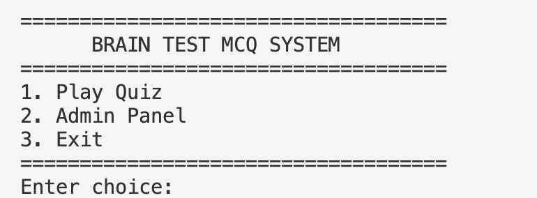
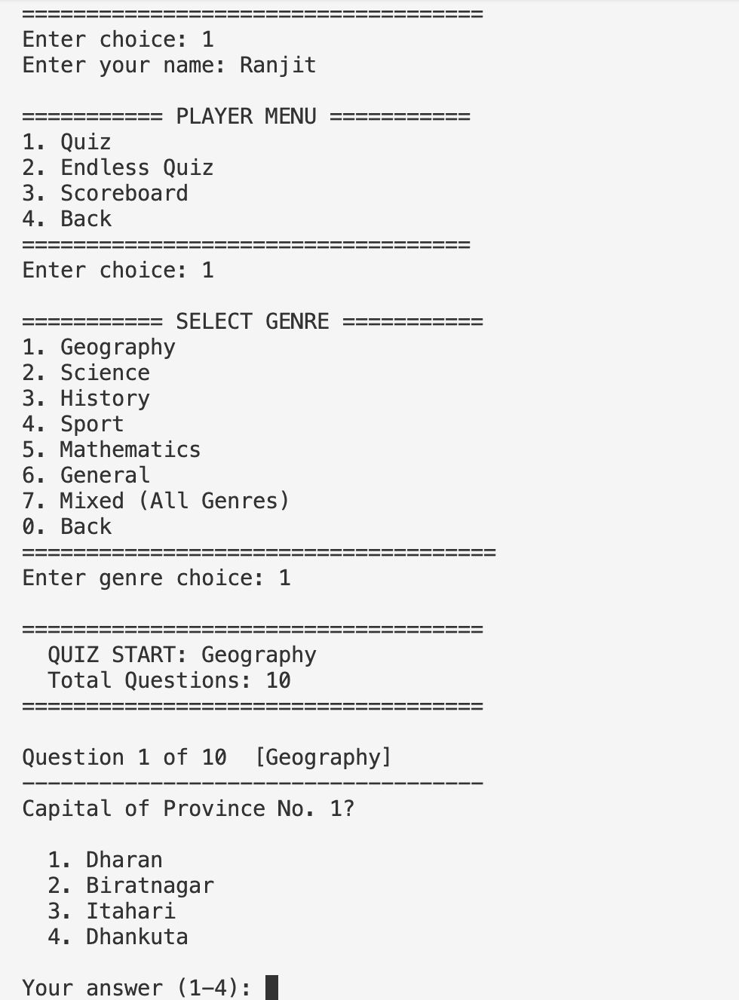
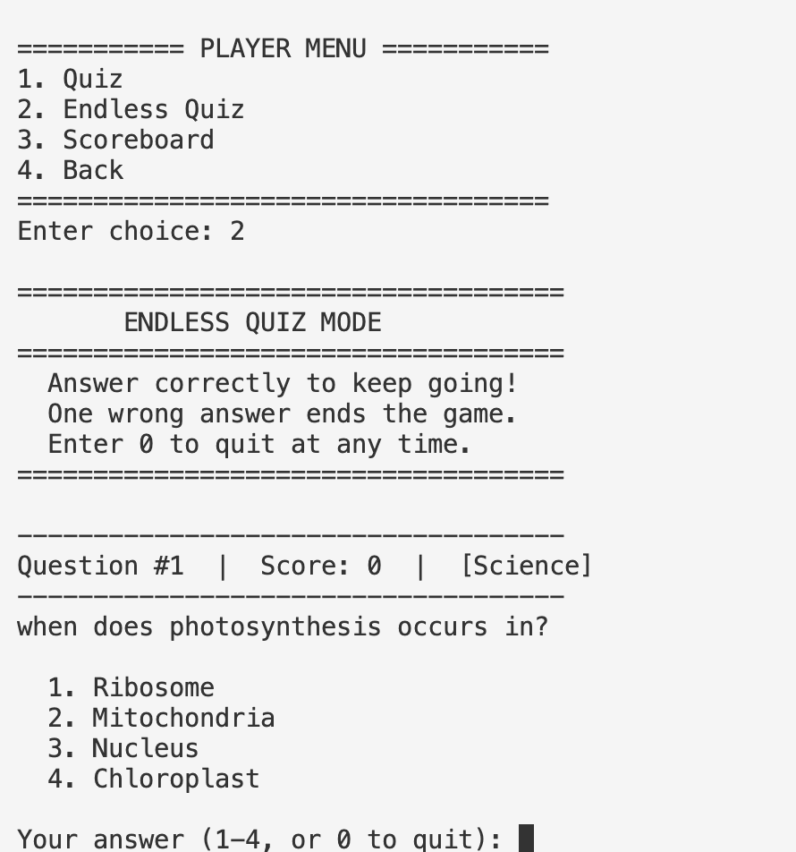
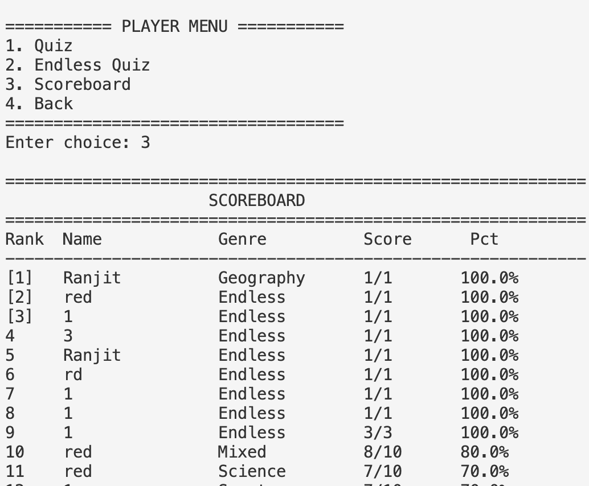
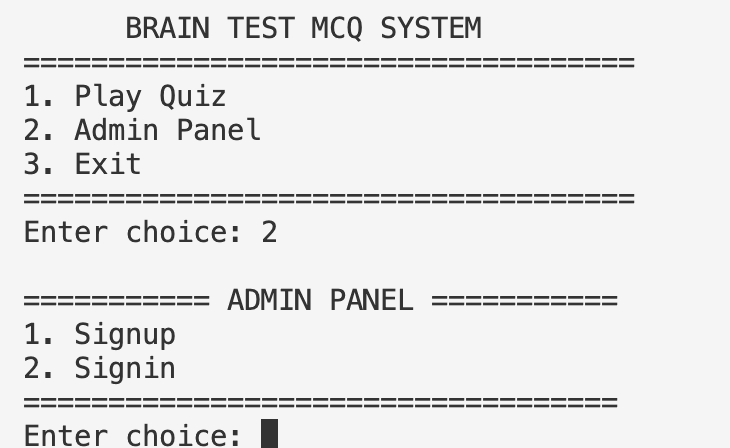

<h1 align="center">🧠 Brain Test MCQ System</h1>

<p align="center">
  
</p>

<p align="center">


</p>

---

# 📖 About

Brain Test MCQ System is a console-based quiz application written in **C**. It provides both **User** and **Admin** modes with file handling, randomized questions, an endless quiz mode, and a scoreboard.

## ✨ Features

- 👤 User Panel
- 🔐 Admin Login
- ➕ Add Questions
- ✏️ Edit Questions
- 🗑 Delete Questions
- 📚 View Questions
- 🎯 Quiz Mode
- ♾ Endless Quiz Mode
- 🏆 Scorecard
- 🔀 Randomized Questions

## 📸 Screenshots

### 🏠 Main Menu



### 🧠 Quiz Screen



### ♾️ Endless Quiz



### 🏆 Scorecard



### 🔐 Admin Panel



## 🛠 Tech Stack

- C Programming
- File Handling
- Structures
- Arrays
- Functions

## 📂 Project Structure

```text
Brain-Test-MCQ-System/
├── README.md
├── src/
│   └── main.c
├── data/
│   ├── question.txt
│   └── userNpass.txt
```

## 🚀 How to Run

```bash
gcc src/main.c -o quiz
./quiz
```

## 🧑‍💻 Author


